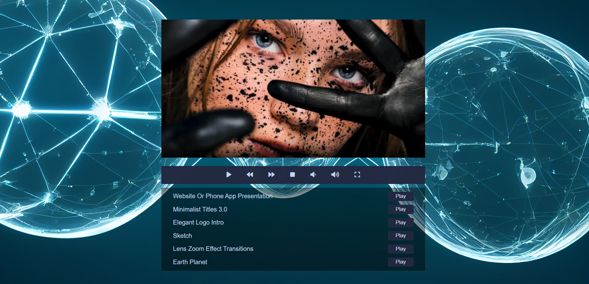

# Video palyer

This educational project is a web application featuring video player. It is built using HTML, CSS, and JavaScript, providing users with the ability to view a list of videos and interact with the video player.

## Features

- **Video Playback:** Users can select and play videos from a list.
- **Controls:** The video player includes controls for play/pause, rewind/forward, and volume adjustment.
- **Full-Screen Mode:** Users can expand the video to full-screen mode for a better viewing experience.
- **Responsive Design:** The layout is responsive and adapts to different screen sizes.

## Tech Stack

- HTML
- CSS
- JavaScript

## Access the App

You can access the application at the following link: [Video Player](https://nataly-horbunova.github.io/video_player/)

## Screenshot

## Getting Started

git clone https://github.com/Nataly-Horbunova/video_player.git

cd video_palyer
